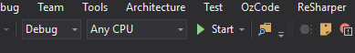
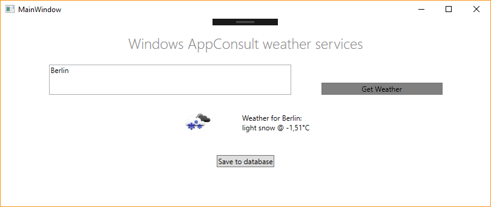
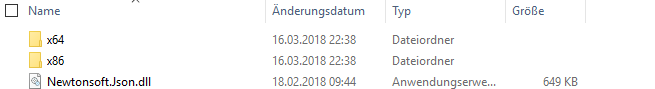
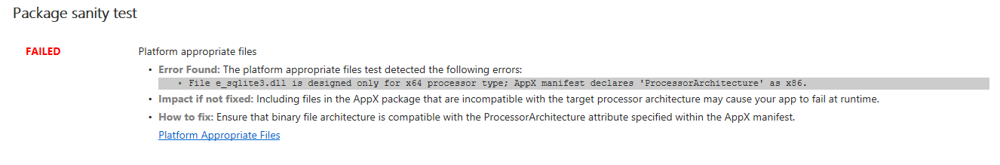
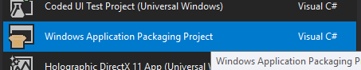
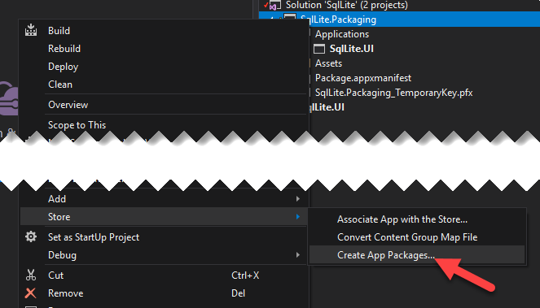
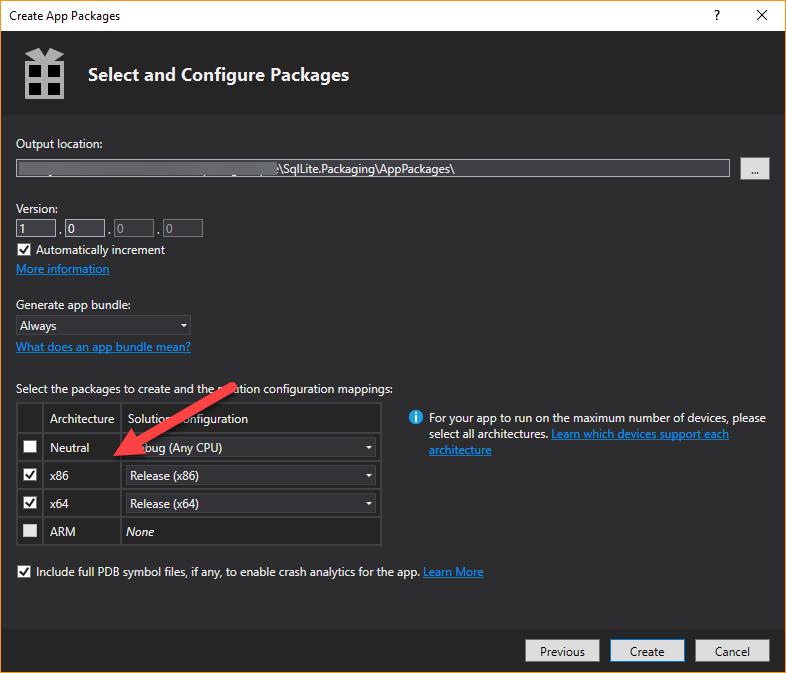
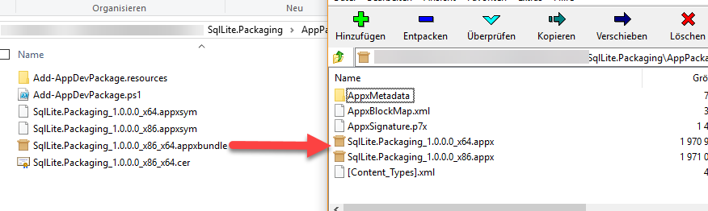
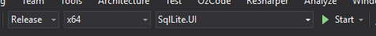
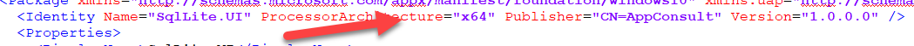

# Handling platform-specific dependencies in Centennial projects

## Setting

So, it happens from time to time that developers struggle with failed WACK results when they use platform-specific dependencies, such as SQLite-NET.
These binaries only come in x86 and x64 flavor (e.g. through NuGet) but never platform-agnostic. I've put a simple WPF project on [GitHub](https://github.com/Microsoft/Windows-AppConsult-Samples-DesktopBridge/tree/master/Blog-Sqlite) that saves some weather data into a local SQLite persistence. You will need a OpenWeatherMap API key that you can get from [here](https://openweathermap.org/appid).
I will use this sample codebase to demonstrate the resulting issue and two possible solutions.

## The issue

When running the app in a native win32 mode, AnyCPU platform configuration works perfectly fine,





as both platform-specific runtimes are provided in the output folder and the most suitable one is selected on execution by the .NET runtime.



Now, what happens when we convert this AnyCPU app to a Store app using Desktop Bridge? Chances are, the app will still run as the runtime tries to pick the right dependency or falls back to x86.

However, the AppxManifest sets the expected processor-architecture. So, although the app might run, there will be a mismatch between the reported app processor-architecture and the processor-architecture of the provided dependency. This mismatch will be found by the WACK tool and will fail the overall test result. (Resulting in not getting the RFT waiver from us and thus not being able to publish the app to the Microsoft Store at all.)



How can you set this straight? There are two ways, actually. If you're are using Visual Studio 2017 to develop your app you can go the very easy way. If you rely on other IDEs or have an extended build chain, some minor use of PowerShell or the command-line is required.

## The easy solution

In Visual Studio 2017 create a new project in your solution, of type 'Windows Application Packaging Project'. Keep in mind this is only a very brief description of the steps required to get this up & running. If you're looking for a more in-depth description of the new VS.NET template, I suggest having a look at the [blog post](https://blogs.msdn.microsoft.com/appconsult/2017/08/28/package-a-net-desktop-application-using-the-desktop-bridge-and-visual-studio-preview/) by my colleague Matteo.



Add your Win32 application to the *Applications* dependency list. Once you have done that, you can right-click on the project and select *Store* -> *Create App Packages...*



This starts a wizard that guides you through the creation of a package for each platform and combines them into a single appxbundle. Neat!
Make sure to uncheck the 'Neutral' architecture and check both x86 and x64!



Hit create! This will result in an appxbundle that contains both processor specific versions of your app.



The wizard will finally take you to an extra step to test the resulting package. Needless to say, it the bundle will pass the tests.


## The almost easy solution

Well, but what if using Visual Studio 2017 is not an option for you? This is where PowerShell or the command line comes to the rescue! Before starting the packaging process, you will need to create a single build for each platform you want to support. This step is crucial! For the sake of brevity, I've only chosen the x64 architecture. My colleague Sebastien created some [extended tools](https://github.com/Microsoft/Windows-AppConsult-Tools-DesktopBridgeRePack) that can help you reducing the required steps to create the packages. You can find a detailed [blog post](https://blogs.msdn.microsoft.com/appconsult/2017/08/07/unpack-modify-repack-sign-appx/) in our AppConsult blog. I won't use these script in order to display the basic steps.

.

The platform-specific result may still contains both platform-specific dependencies. Delete the non-matching ones. Assuming you have the Desktop App Converter installed and configured, you can now create the platform-specific package with a single command. If you haven't, you will need to create the folder that contains the package content and all meta data (AppxManifest, Assets, Binaries etc) manually. The [AppConsult blog](https://blogs.msdn.microsoft.com/appconsult/tag/desktop-bridge/) has some post on how to achieve this. In that case, you can skip the next two steps and head over directly to the ```makeappx``` command.

```ps
PS E:\tmp\Code-DesktopBridge-Sqlite> DesktopAppConverter -Installer "E:\tmp\Code-DesktopBridge-Sqlite\SqlLite.UI\bin\x64\Release" -Destination "E:\tmp\Code-DesktopBridge-Sqlite\Package\x64" -AppExecutable "SqlLite.UI.exe" -PackageName "SqlLite.UI" -Publisher "CN=AppConsult" -Version "1.0.0.0" -MakeAppx -Sign -Verbose
```

This will create everything you need for a start. But we're not done yet, as you need to make sure the package architecture matches your build architecture. Open the AppxManifest.xml and check the processor architecture property.



If there are changes to the AppXManifest needed, you would need to repackage the app by issuing a ```makeappx``` command.

```ps
makeappx pack -d '.\PackageFiles\' -p '.\SqlLite.UI.x64.1.1.0.0.appx' -l
```

If you happen to have multiple platform-specific packages that needs to be bundled into an appxbundle, one final call to ```makeappx``` is required.

```ps
makeappx.exe bundle /d '.\AppxPackages'  /p 'SqlLite.UI.1.1.0.0.appxbundle'
```

And you're done. Running the package sanity test of the WACK suite should not yield any issues anymore.


## Conclusion

The package sanity test is a required test that is executed by us in any case before we grant the RFT waiver. Since the appx packages are platform-specific, the developers need to take that into account when repacking their apps for the Microsoft Store.