# Microsoft Graph and HoloLens: Authentication

<!-- TOC -->

- [Microsoft Graph and HoloLens: Authentication](#microsoft-graph-and-hololens-authentication)
    - [The Idea](#the-idea)
    - [The Preparation](#the-preparation)
        - [The part where you can use your mouse](#the-part-where-you-can-use-your-mouse)
        - [The part that involves Visual Studio](#the-part-that-involves-visual-studio)
    - [Unity3d](#unity3d)
        - [New project preparation](#new-project-preparation)
        - [Setting up the scene](#setting-up-the-scene)
        - [Using Plugins](#using-plugins)
        - [Wiring it all together](#wiring-it-all-together)
    - [Conclusion](#conclusion)

<!-- /TOC -->

## The Idea

When I was embedded into the LIT Studio team earlier this year, I had an interesting task: using msgraph to access user metadata. Metadata as in O365 documents or files on OneDrive. Given the various libraries this is a rather easy task in the Windows world, but doing so in a Unity project has its pitfalls. Back then, I found an [article from my colleague Pete Daukintis](http://peted.azurewebsites.net/microsoft-graph-auth-on-hololens/), only outlining the rough process. I didn't quite work out-of-the-box for my use case, but after a couple of days trying (and swearing) I had a working PoC. The code was ugly, used lots of compiler directives and was generally-speaking in the category of


  Since then I've came across a couple of requests from customers and colleagues alike looking for guidance in similar scenarios. So I decided to make it look nice (and re-usable) and **public**. Since it's a two-step-process (authentication and actual msgraph usage) I decided to split the post into two parts. This one is about authentication.

## The Preparation

### The part where you can use your mouse

In order to be authorized to the msgraph API, you need to authenticate against Azure AD or MSA first. You can either do this all by yourself or just be reasonable and use the [MSAL (Microsoft Authentication Library)](https://github.com/AzureAD/microsoft-authentication-library-for-dotnet) instead. It brings it's own token-store, handles the browser window and allows silent logins.

Before you can use that library, you'll need to register an application in the [app registration portal](https://apps.dev.microsoft.com/#/appList). Look for ```Converged applications``` and click on ```Add an app```. Choose a name and select ```Native Application``` on the next screen.

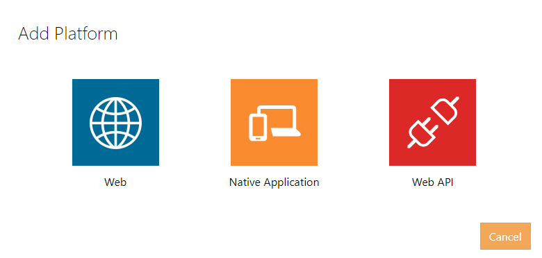

This will generate an ApplicationId, which we will need later on. Also, we need to set up the right scopes. Go to ```Microsoft Graph Permissions``` add some ```Delegated Permissions```. I'm going to access the OneDrive in part two, hence I'm adding ```Files.ReadWrite.All``` to the existing ```User.Read``` scope.

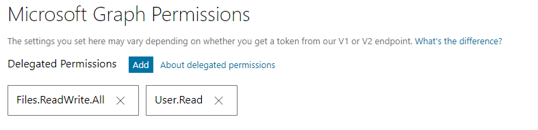

### The part that involves Visual Studio

Testing and debugging scripts isn't really one of Unity's strengths, especially when dealing with plugins. I've decided to debug and test my library on the lens in a simple UWP environment first. This allows much quicker prototyping. The UWP code is (as usual) available on GitHub, alongside with the Unity project and the placeholder plugin.

*A small note on the sample code: almost all of my method signatures accept an ```Action<string>``` callback. I wouldn't normally do this in LoB application development where I can use IoC to inject the logging framework of my choice on instantiation. In Unity, ctor injection isn't really a thing. The logging callback seems to be the most clean and obvious approach to me for this sample.*

The UWP project structure is pretty simple, it contains a library project and a UI project. The library is consumed by the UWP UI and by the Unity application. By providing a placeholder library to Unity project, I can also run the the sample in the Unity Editor without ruining code with compiler directives. More on that later.

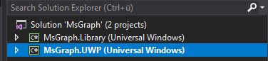

Let's add ```Microsoft.Identity.Client``` as new NuGet dependency to the library project (it's still in beta, so enable previews).
Although the MSAL brings its own key management, I use the ```Windows.Security.Credentials.PasswordVault``` for storing UserId and AccessToken. This is to avoid leaking the MSAL dependency into any msgraph component. Storing the token in ```ApplicationData.Current.LocalSettings``` is not considered safe. Have a look at my ```CredentialService``` class, if you're interested.  [More on the credential locker here](https://docs.microsoft.com/en-us/windows/uwp/security/credential-locker).

The authentication implementation is exposing methods to sign in and sign out through an interface. It also exposes an ```Init``` method that takes the Application Id as parameter.

```cs
public interface IMsaService
{
    void Init(string appId);
    Task SignInAsync(Action<string> error);
    void SignOut(Action<string> error);
}
```

The actual implementation is pretty straight forward. The only thing worth mentioning is the flow in the private method ```AcquireTokenAsync```. To avoid going through the OID flow every time the login button is pressed, I try to acquire the token silently from the token store first. If that is failing, an ```MsalUiRequiredException``` is thrown and a browser view is opened for the manual login.

```cs
try
{
    //omitted...
    return await client.AcquireTokenSilentAsync(Scopes, user).ConfigureAwait(false);
}
catch (MsalUiRequiredException)
{
    //give it another try, this time with an UI
    try
    {
        return await client.AcquireTokenAsync(Scopes).ConfigureAwait(false);
    }
    //omitted...
}
catch (Exception e)
{
    //omitted...
}

return null;
```

Running the project on the remote device gives the expected result.

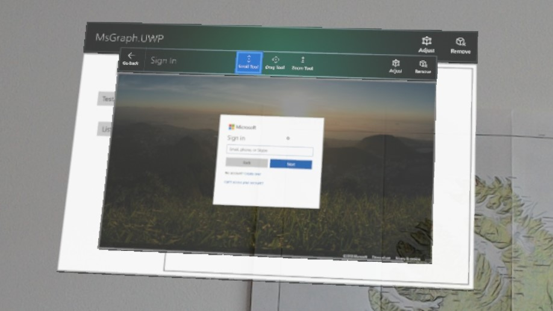

## Unity3d

### New project preparation

First of all, I need to adjust various settings of the new Unity project. I change the Build settings for UWP...

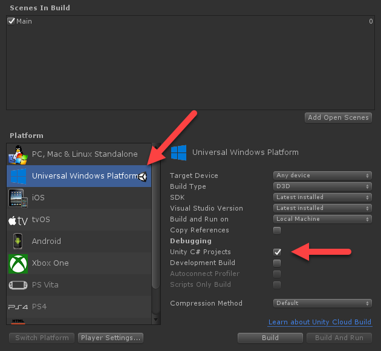

...And modify a couple of important player settings.

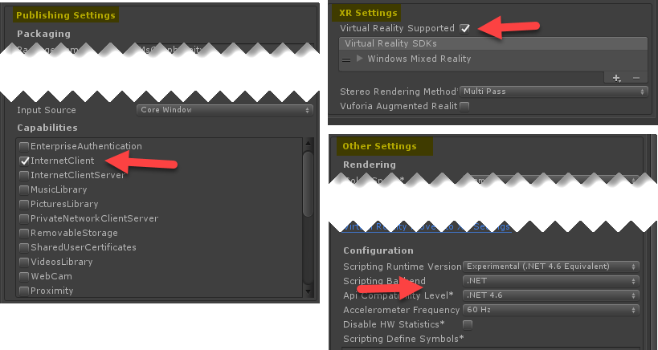

The [MixedReality-Toolkit](https://github.com/Microsoft/MixedRealityToolkit) offers components for application development targeting the Windows MixedReality ecosystem. The latest *.unitypackage is available from their [release page](https://github.com/Microsoft/MixedRealityToolkit-Unity/releases/latest). I won't need everything, however I just import everything for now and apply the various settings to the scene and project according to the [documentation](https://github.com/Microsoft/MixedRealityToolkit-Unity/blob/master/GettingStarted.md#4-preparing-your-project-for-mixed-reality-content).

### Setting up the scene

I add two ```RectangleButton```s and an ```UIText``` to the scene, they can be found in the UX prefabs folder of the MRTK. I will use them to start the login flow and display the log result. After renaming and positioning the elements accordingly, my scene now contains the following elements:

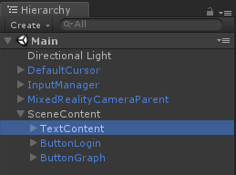

### Using Plugins

Next, I add a *Plugins* and *Scripts* folder to the project. I've also added a *WSA* subfolder to the *Plugins* folder, but purely out of convention. The libraries (MSAL, MsGraph and my UWP one) will go into the subfolder of the *Plugins* folder. The scripts that handle the ```IInputClickHandler``` of the buttons will go into the *Scripts* folders.

There are two ways of finding the right libraries to use in Unity. The easiest way is just building & deploying the UWP project to the lens (in a Release x86 configuration). The suitable dependencies are now in the bin folder and can be copied over into the recently created *Plugins* folder of the Unity project. The other approach is manually downloading the *.nupkg file from NuGet, unpacking it, and copying the Win81 / netcore451 version of the dependency over to Unity. The UWP library needs to be build and placed into the *Plugins* folder of the Unity project as well.
Those libraries don't really work well with Unity. They cause many patch errors and other issues for example when being called from the Unity Editor. Solving these issues requires two steps, that are also outlined in the [official documentation](https://docs.unity3d.com/Manual/windowsstore-plugins.html).

First, I had to uncheck Editor and Standalone as viable platform for the dependency. It's also important to check 'Don't process' to tell Unity to ignore the plugin when processing and patching. It's important to do this for all added dependencies.

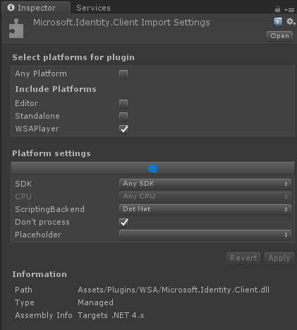

The next step is to provide a placeholder plugin (based on netcore451) that can be consumed by the Editor. This allowed me to test the scene in the Unity Editor again, but without any platform-specific dependencies. That is great for fine-tuning the placement of objects. I also added the ```MsGraph.Library.Placeholder``` solution to the sample code, but it's just an stub project. The MSAL library doesn't need a placeholder plugin, as my UWP library encapsulates that dependency.

```cs
public interface IMsaService
{
    void Init(string appId);
    Task SignInAsync(Action<string> error);
    void SignOut(Action<string> error);
}

public class MsaService : IMsaService
{

    public void Init(string appId)
    {
    }

    public async Task SignInAsync(Action<string> error)
    {
        error("running editor only");
    }

    public void SignOut(Action<string> error)
    {
        error("running editor only");
    }
}
```

 **It's really important to target the .NET framework (netcore451) in project build settings and to use the same namespace and assembly version number!**

The resulting structure in the Plugins folder should now look like this:

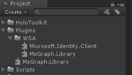

### Wiring it all together

Good! Time to put everything together, as the important bits are in place now.
I add two scripts and place them into the Scripts folder. The first one will act as base class for the our buttons, the other one will be the actual script that I will attach to the button. The base class just initializes the error callback for now. The callback either logs to the UiText or the Debug console.

```cs
public abstract class BaseButton : MonoBehaviour, IInputClickHandler
{
    protected Action<string> updateTextContent;
    private Text textContent;

	protected virtual void Start () 
	{
	    this.textContent = GameObject.Find("TextContent").GetComponent<Text>();
        
	    updateTextContent = (s) =>
	    {
	        if (textContent != null)
	        {
	            textContent.text += Environment.NewLine + s;
	        }
	        else
	        {
                Debug.Log(Environment.NewLine + s);
	        }
	    };
	}

    public abstract void OnInputClicked(InputClickedEventData eventData);
}
```

The second script (attached to the Login button) exposes an ```ApplicationId``` property to the Unity Editor. This is the place to put in the application id from the app registration portal. My authentication service implementation is instantiated and initialized in the ```Start``` method, the actual call to start the login only happens on click. Since I'm targeting the .NET 4.6 Api Compat Level, I can happily use async & await.

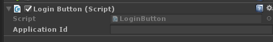

```cs
public sealed class LoginButton : BaseButton
{
    public string ApplicationId;
    private IMsaService msaService = null;

    protected override void Start()
    {
        base.Start();
        msaService = new MsaService();
        msaService.Init(ApplicationId);
    }

    public override async void OnInputClicked(InputClickedEventData eventData)
    {
        await msaService.SignInAsync(updateTextContent);
    }
}
```

With everything ready for the shwo, I can now build the Unity project, head over the Visual Studio and deploy it to the lens.

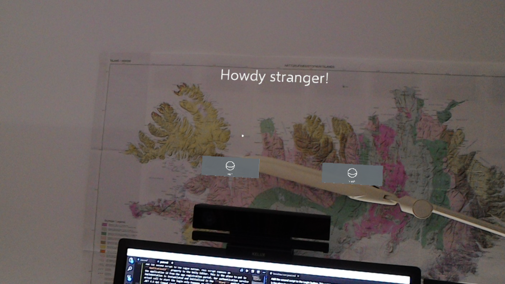
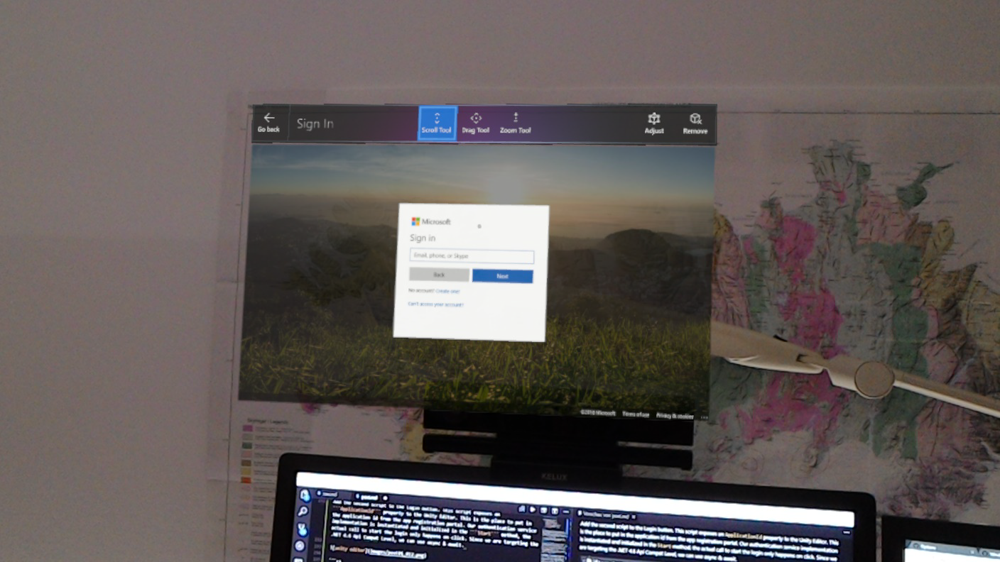

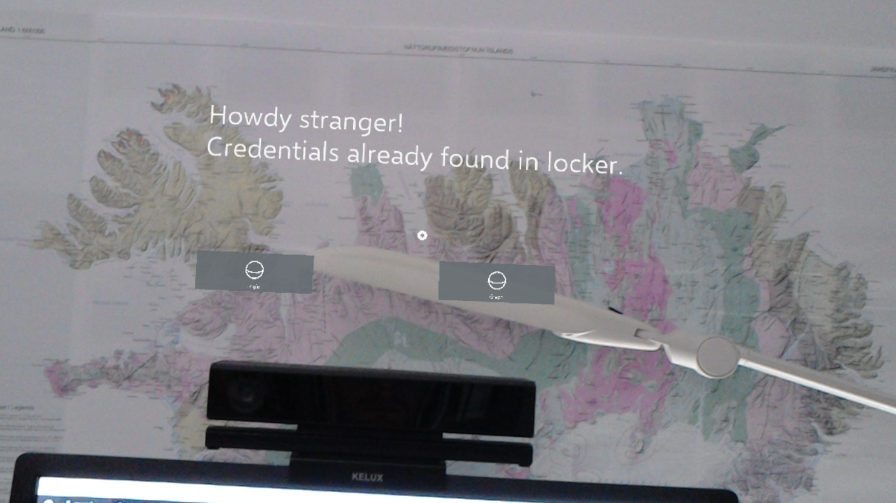

## Conclusion

I have moved the main development part from Unity3D into a straight-forward UWP project. This approach allows solving the main programming task without touching Unity at all. (Which is rather neat!) As a result, I could test my components to some extend and have a quite flexible abstraction. The "don't process" setting of the plugin and the placeholder plugin concept may have caused some swearing on my side as this is rather unusual for any non-Unity developer. Having solved that, I'm looking forward to add the actual Microsoft Graph implementation very quick (Spoiler alert from future-me who has all the code ready: It isn't. It's the worst part.)