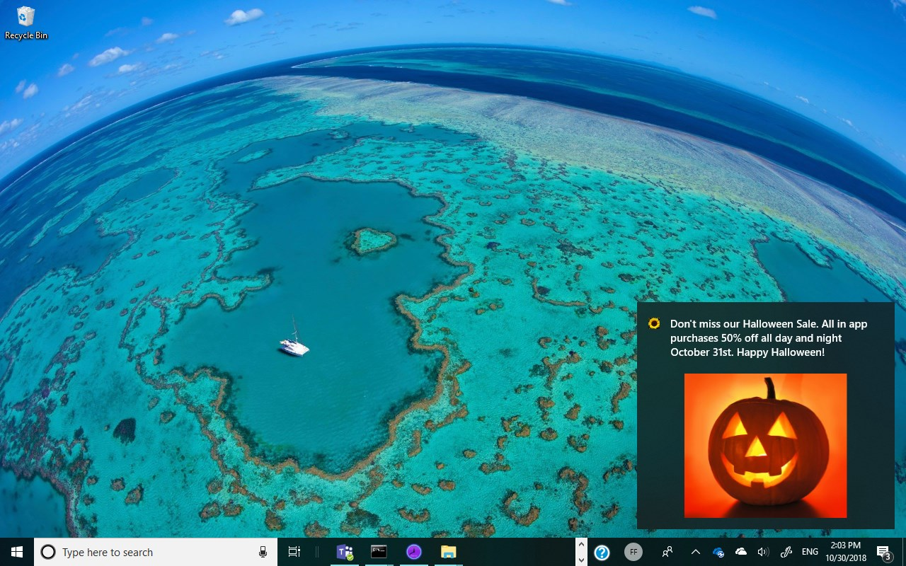
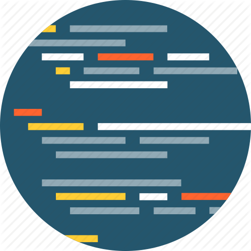

# Add Push Notifications to your app the easy way with Partner Center + Microsoft Store Services SDK



What if I told you that you could implement Windows toast and tile notifications with just two lines of code? Would you be interested?
  
What if I told you that you didn't have to implement any server side code? Are you more interested?
  
What if I told you that you could do this in your progressive web app, UWP or Win 32 app? Is your interest now off the charts?? If so, read on!

With the combination of the [Engagement feature of Partner Center](https://docs.microsoft.com/en-us/windows/uwp/publish/send-push-notifications-to-your-apps-customers) and the [Microsoft Store Services SDK](https://docs.microsoft.com/en-us/windows/uwp/mosnetize/microsoft-store-services-sdk) you can easily add Push Notifications to your [Windows Progressive Web App](https://docs.microsoft.com/en-us/microsoft-edge/progressive-web-apps) (PWA), [UWP](https://docs.microsoft.com/en-us/windows/uwp/get-started/universal-application-platform-guide), or [Desktop Bridge - Win32 app](https://aka.ms/desktopbridge).

## <a name="powerfulpush"></a>Powerful Push with Windows Notification Services

Push notifications in Windows are very powerful and flexible allowing you to target specific information to specific users. This, however, requires you integrate with the Windows Notifications Service (WNS), set up a server app to send notifications and add code to your client application that registers with WNS. While this gives your business flexibility and one to one targeting, it may be more than what you need. For an excellent walkthrough of setting up WNS Push Notifications, see this post, [Push notifications in a PWA running on Windows 10](https://blogs.msdn.microsoft.com/appconsult/2018/06/07/push-notifications-in-a-pwa-running-on-windows-10/) written by [Matteo Pagani](https://twitter.com/QmatteoQ).

## Easy Push with Microsoft Store Services Notifications

In contrast to 'WNS', 'Microsoft Store Services Notifications' sends general toast and tile updates to user groups you define. This can be:

* All of the users of all of your apps and games.
* All of the users of a specific app.
* All of the users of some of your apps.
* Subsets of the above, [grouped by demographic criteria](https://docs.microsoft.com/en-us/windows/uwp/publish/create-customer-groups) you specify. **The marketers in your organization will love this feature.** For example, you may want to reward your big spending customers with a [promotional code](https://docs.microsoft.com/en-us/windows/uwp/publish/generate-promotional-codes) that can be used for a free license for a new app you are releasing. You may want to up-sell your low spending customers on in app purchases.

 Note that with Microsoft Store Services notifications you don't send specific data to specific users. This is very useful for:

* Cross promoting your apps. For example, if you have launched a new app, ask users of your other apps to check it out.
* Letting your users know when your apps or IAP go on [sale](https://docs.microsoft.com/en-us/windows/uwp/publish/set-and-schedule-app-pricing).
* Requesting feedback.
* Sending ad hoc announcements and information to your users. For example, providing down time schedules, new feature announcements, or service alerts.

Microsoft Store Services notifications also support [interactive toast messages](https://docs.microsoft.com/en-us/windows/uwp/design/shell/tiles-and-notifications/adaptive-interactive-toasts) which allow users to interact with your app without having to launch it. This requires adding the client code to support the interaction.

Microsoft Store Services notifications can't send information customized for a specific user. For these types of notifications, see ['Powerful Push'](#powerfulpush) above.

## Let's see the code!

To implement the `Microsoft Store Services notifications` you will:

1) Install the [Microsoft Store Services SDK](https://docs.microsoft.com/en-us/windows/uwp/mosnetize/microsoft-store-services-sdk)

2) Add a Reference to the ```Microsoft.Services.Store.SDK``` in your project. See highlighted below:


3) <a name="registrationcode"></a>Add the following code to the Start up of your app:

```cs
// Setup connection between app and Microsoft Store Services
StoreServicesEngagementManager engagementManager = StoreServicesEngagementManager.GetDefault();
var res = await engagementManager.RegisterNotificationChannelAsync();
```

4) Associate your app with the Store in Visual Studio. Go to the Project menu -> Store -> Associate App with Store

5) Publish your app to Partner Center using the ['Limited Audience' or 
'Hidden' visibility options](https://docs.microsoft.com/en-us/windows/uwp/publish/choose-visibility-options). You need to do this because in order to setup the push notifications Partner Center will need to explicitly reference your app. In order to do this, your app must be published with a reference to the `Microsoft.Services.Store.SDK`. Note that the publishing process can take up to three business days.

6) Once your app has published, you don't need to install it from the Store. You can continue to develop the app - just make sure the [identity](https://docs.microsoft.com/en-us/windows/uwp/publish/view-app-identity-details) of the app matches what you have submitted to Partner Center.

7) In the `Engagement` section of `Partner Center` define and send your Toast and Tile Push Notifications.

   7.1. In `Partner Center`, select `Engage` and you should see the `Notifications` page as shown below.

   

   7.2. Click `New Notification`

   7.3. Click `Blank Toast`, `OK`

   7.4. From the drop down, select the app or apps to send notifications. See screenshot below:

   

   7.5 Here are some sample values for this toast notification:

   **Name:** My First Engagement Push

   **Customer Groups:** All Users
  
   **Send Notification Immediately:** Check
  
   **Notification Never Expires:** Check
  
   **Language:** English (default)
  
   **Activation Type:** Foreground
  
   **Duration:** Short
  
   **Scenario:** Default
  
   **Visual (text 1):** Hello from My App!

   Click `Send`

Your notification will be sent immediately it will take up to one minute to receive the notification. Note that the app's registration code [(Step 3)](#registrationcode) should have been run at least once. Note that the app doesn't need to be running in order to receive the notification.

Did it arrive? Yes. High-Five!
No? Here are some things to check:

* Did the registration code run?
* Does the app's [identity](https://docs.microsoft.com/en-us/windows/uwp/publish/view-app-identity-details) match it's definition in Partner Center?
* Are you sending the notification to the correct app?

## How about a sample?

In the following steps, I'll describe the code found here: [https://github.com/Microsoft/Windows-AppConsult-samples-PWA/tree/master/DevCenterNotifications-PWA](https://github.com/Microsoft/Windows-AppConsult-samples-PWA/tree/master/DevCenterNotifications-PWA)

This sample implements the registration code [(step 3)](#registrationcode) in a Windows Runtime Component (**PushWinRTComponent**). For easy integration, free free to use it.

PushWinRTComponent exposes the method `PushNotifications.init()` that will be called via JavaScript as follows:

```javascript
// index.html
// Set up Push notifications
if (typeof Windows !== 'undefined' &&
  typeof Windows.UI !== 'undefined' &&
  typeof Windows.UI.Notifications !== 'undefined') {
  PushWinRTComponent.PushNotifications.init().then(
    function (result) {
      console.log("push init result: " + result);
    });
}
```
Happy Coding!

References:

[Send notifications to your app's customers](https://docs.microsoft.com/en-us/windows/uwp/publish/send-push-notifications-to-your-apps-customers)

[Push Notifications in a PWA Running on Windows 10](https://blogs.msdn.microsoft.com/appconsult/2018/06/07/push-notifications-in-a-pwa-running-on-windows-10/)
